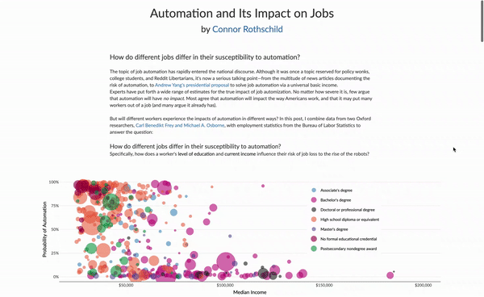

README
================

Scrollytelling in R—because its a lot easier in D3. See the output [here](https://connorrothschild.shinyapps.io/automation/).

For more information on how to build your own Scrollytelling article in R, visit [my blog post on the subject](https://www.connorrothschild.com/post/automation-scrollytell/). 